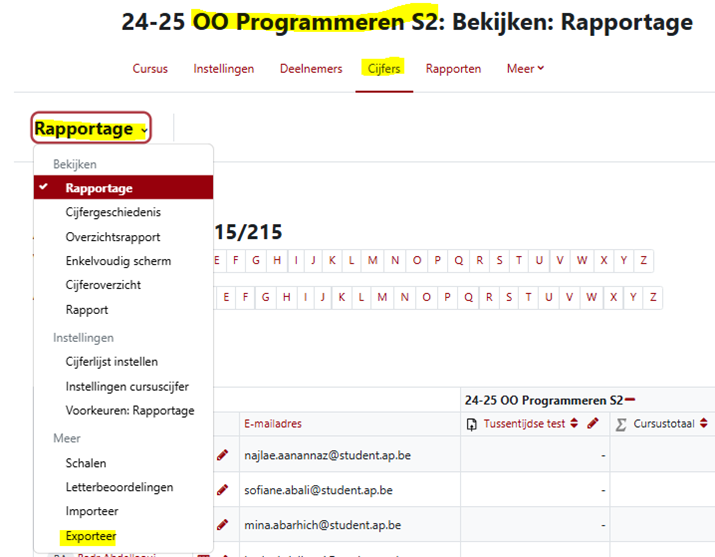
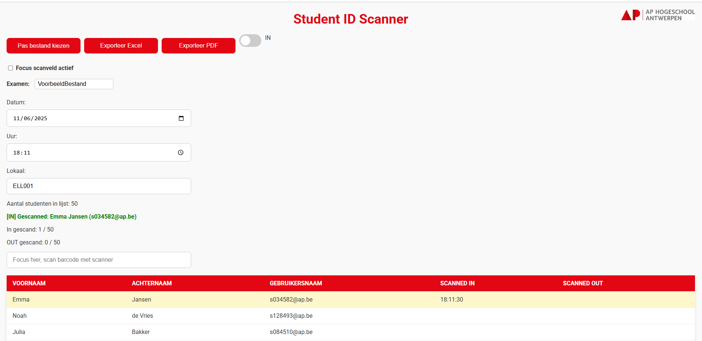

# StudentIdScanner# Scanner Tool

Deze tool is bedoeld voor het scannen van studentennummers bij examens, met ondersteuning voor:

✅ Scannen IN en OUT  
✅ Handmatig invoeren van studentnummers  
✅ Automatische verwerking van Excel-lijsten  
✅ Visuele status per student (kleurcodes)  
✅ Export naar PDF en Excel  
✅ SessionStorage: bewaart status bij refresh  
✅ Ondersteuning voor examennaam, datum, uur en lokaal

---

## Functionaliteiten

### 📥 Importeren van studentenlijst

- Upload een `.xlsx` bestand (Excel), gestructureerd als:

| Voornaam | Achternaam | Studentnummer |
|----------|------------|---------------|

- Na upload worden kolommen **Scanned In** en **Scanned Out** automatisch toegevoegd.

### 🎟️ Scannen / Handmatig invoeren

- Gebruik een scanner of het handmatige invoerveld om studentnummers te scannen.
- Schakel tussen **IN** en **OUT** modus.
- Status per student wordt met kleur weergegeven:
  - **Geel** → gescand IN
  - **Groen** → gescand OUT
- Dubbelscans en fouten worden gemeld.

### 🕒 SessionStorage

- Inhoud van het Excel-bestand, scanstatussen en velden (examennaam, datum, uur, lokaal) blijven bewaard bij refresh (zolang tab open blijft).

### 📤 Exporteren

- **Export naar PDF** met header (examennaam, datum, uur, lokaal, aantal gescande IN/OUT) en paginanummers.  
→ De PDF wordt **gesorteerd op scanstatus** (OUT bovenaan, dan IN, dan niet-gescand).  
→ De tabel op het scherm blijft ongewijzigd.

- **Export naar Excel** met volledige scaninformatie.  
→ Ook hier wordt een **gesorteerde kopie van de data geëxporteerd**, zonder de UI te beïnvloeden.

### Technische details → Sortering bij export

Bij het exporteren wordt een **gesorteerde kopie van de data** gebruikt, zodat de weergegeven tabel op het scherm niet beïnvloed wordt.  
→ Dit voorkomt het noodzaak om te refreshen na export.

---

## Gebruik

1. Upload je studentenlijst via de "Choose file" knop.
2. Examennaam wordt automatisch uit bestandsnaam gehaald of kan manueel worden aangepast.
3. Vul datum, uur en lokaal in.
4. Start met scannen:
   - Schakel tussen **IN** en **OUT**.
   - Scan studentnummers (scanner of handmatig).
5. Exporteer het resultaat naar PDF of Excel indien gewenst.

---

## Technische details

- **Frontend:** HTML + JavaScript
- **Dependencies:**
  - [SheetJS (XLSX.js)](https://github.com/SheetJS/sheetjs) → voor Excel inlezen
  - [jsPDF](https://github.com/parallax/jsPDF) + `autoTable` → voor PDF export

### Kleuren

- `.row-in` → geel → student gescand IN
- `.row-out` → groen → student gescand OUT
- `.match` en `.no-match` zijn legacy CSS → momenteel enkel `row-in` en `row-out` gebruikt.

---

# Student ID Scanner

Deze tool wordt gebruikt om studenten in en uit te scannen bij examens.  
Je kan eenvoudig een studentenlijst uploaden (Excel) en de scanstatus bijhouden.  
Exporteren naar PDF en Excel is voorzien.

---

## Werkwijze

1. Ga naar je vak in **toets.ap.be**
2. Navigeer naar **Cijfers → Rapportage → Exporteer** om je studentenlijst te exporteren
3. Open de Scanner tool (scanner.html)
4. Upload je Excelbestand
5. Vul Examennaam, Datum, Uur en Lokaal in
6. Start met scannen:
    - Schakel tussen **IN** en **OUT**
    - Scan studentnummers met scanner of manueel
7. Exporteer resultaten naar PDF of Excel indien gewenst

---

## Voorbeeld screenshot

  

---

## Functionaliteiten

- Upload Excel studentenlijst
- Scannen IN / OUT
- Handmatige invoer
- Kleurcodering:
    - **Geel:** IN gescand
    - **Groen:** OUT gescand
- SessionStorage: bewaart status bij refresh
- Export naar PDF (met paginanummering en header) en Excel

---

## Dependencies

- [SheetJS (XLSX.js)](https://github.com/SheetJS/sheetjs)
- [jsPDF](https://github.com/parallax/jsPDF)
- [jsPDF AutoTable](https://github.com/simonbengtsson/jsPDF-AutoTable)

---

## Licentie

Vrij te gebruiken voor onderwijsdoeleinden.

---

🎓 **Developed by Stephane Van Rossem, Vincent Van Camp
